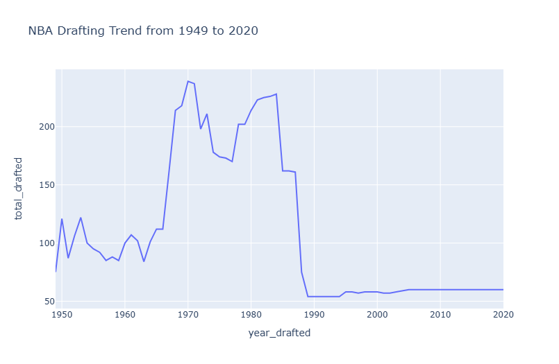
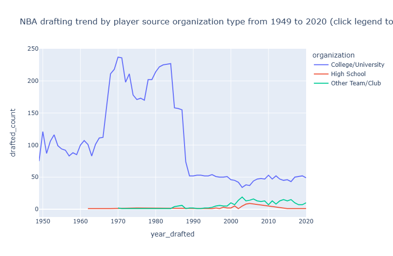
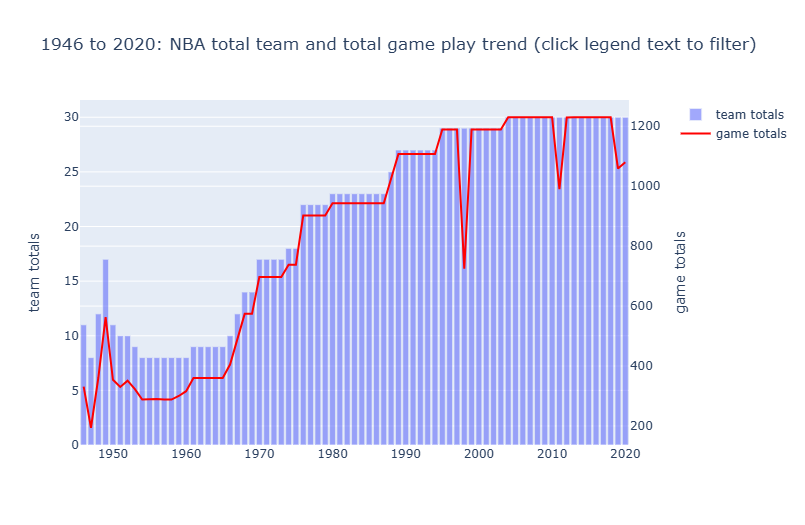
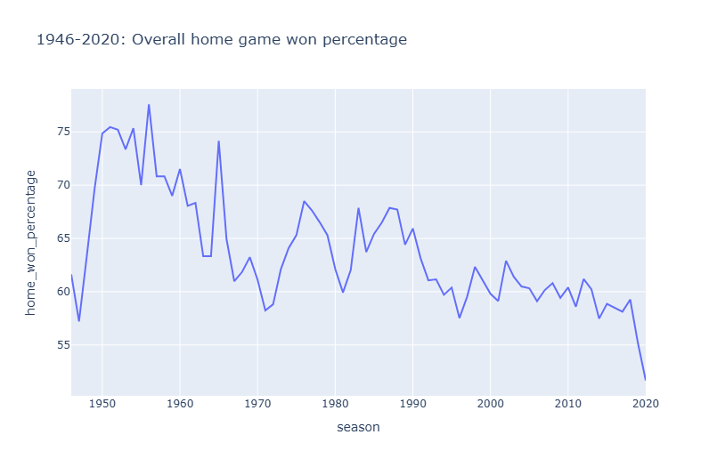
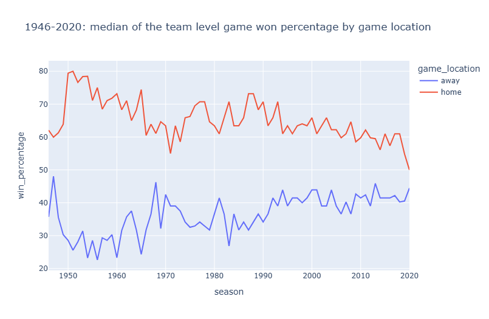
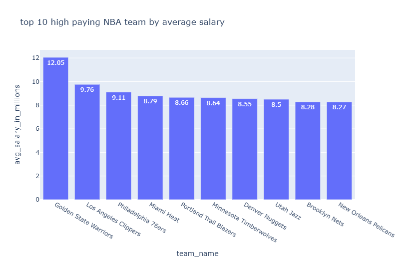

# Historic NBA Drafting, Game, and Player Analysis

## Project Overview

This project focuses on analyzing historical data from the NBA between 1946 and 2021, using a structured SQL database. The goal was to explore and visualize trends in NBA drafts, team performance, game outcomes, and player statistics. Key analyses include how many players were drafted each year, which teams have been most active in drafting, win percentages in home vs. away games, and how player performance and salaries relate. Data was extracted using SQL, cleaned and analyzed using Pandas, and visualized through interactive Plotly charts for better insights.

## Features

- **Draft Trends**: Year-by-year player draft counts and team-wise drafting patterns.
- **Source Breakdown**: Distribution of drafted players by origin (college, international, etc.).
- **Game & Season Analysis**: Trends in number of teams/games per season; home vs. away win percentages.
- **Performance Metrics**: Median free-throw and three-point percentages by location (home/away).
- **Salary Insights**: Top-paid players and highest-paying teams for the 2020–21 season.

## Installation

1. Clone the repository:
   ```bash
   git clone https://github.com/Chessman08/Historic_NBA_Player_Analysis.git
   cd Historic_NBA_Player_Analysis
   ```
2. Create a virtual environment and install dependencies:
   ```bash
   python3 -m venv venv
   pip install -r requirements.txt
   ```
   
## Dataset

This project uses the "Basketball Dataset" from Kaggle, which includes player stats, team data, game information, and more.

The dataset is approximately **4.66 GB** and is therefore not included in this repository.

### Setup Instructions

1.  **Download the Dataset:**
    * Go to the Kaggle dataset page: [https://www.kaggle.com/datasets/wyattowalsh/basketball](https://www.kaggle.com/datasets/wyattowalsh/basketball)
    * Click "Download" to get the `archive.zip` file.

2.  **Place the Dataset:**
    * Create a folder named `dataset` in the root directory of this project.
    * Unzip the `archive.zip` file and place all its contents directly inside the `dataset` folder.

The final project structure should look like this:

    ├── data/
    │   ├── Basketball.sqlite
    │   ├── Other_CSV_files...
    ├── SQL_Analysis/
    │   ├── Historic_NBA_Player_Analysis.ipynb
    ├── .gitignore
    ├── requirements.txt
    └── README.md

## Usage

1. Place the basketball.sqlite database file under the root directory or update db_path in the script.
2. Run the analysis script:
   ```bash
   python Historic_NBA_Player_Analysis.ipynb
   ```
3. Visualizations will open in your default web browser.

## Visualizations & Results

**Note:** The plots in the original Jupyter Notebook file may not render correctly on GitHub due to library updates. The key results and visualizations from the analysis are displayed below.

---

### NBA drafting trend from 1949 to 2020

This plot captures the dramatic evolution of the NBA draft over 71 years, highlighting several key trends.



---

### NBA drafting trend by source organisation type

This plot illustrates the overwhelming dominance of US colleges as the primary talent pipeline for the NBA draft.



---

### NBA total team and total game play trend

This plot reveals two parallel growth stories in the NBA's history.

It shows the total number of games played per season has risen dramatically, not only due to more teams but also from the standardization of the regular season to 82 games, a format that has remained the benchmark for decades.



---

### Overall home game won percentage

This plot illustrates the significant and consistent "home-court advantage" in the NBA. It shows that, across the league, home teams reliably win a clear majority of their games, a percentage that has remained remarkably stable over many seasons.



---

### Median of the teal level game won percentage by game location

This plot breaks down team performance by location, showing that a typical (median) NBA team has a winning record at home and a losing record on the road. It visualizes the powerful home-court advantage by showing the stark contrast between the median home win percentage (well above 50%) and the median away win percentage (well below 50%)



---

### Top 10 high paying NBA team by average salary

This chart ranks the NBA's biggest spenders, showcasing the top 10 teams by their average player salary. The list is typically dominated by "big market" franchises and ambitious teams willing to pay a premium (and often the luxury tax) to build a roster filled with superstar talent in pursuit of a championship.



---

## Technologies

- Python 3.x
- SQLite for data storage and querying
- Pandas for data manipulation
- Plotly for interactive charts

## License

This project is licensed under the [**LICENSE**](https://opensource.org/licenses/MIT).

